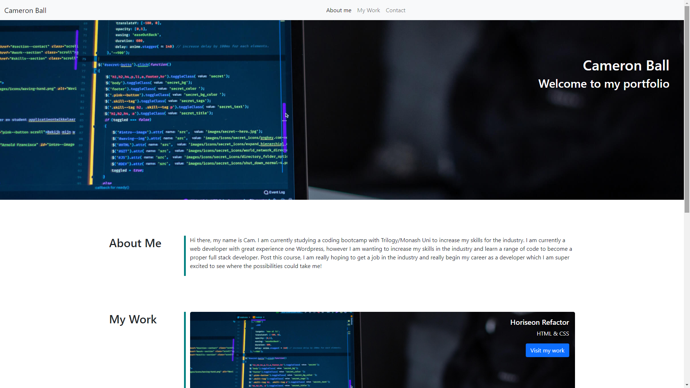

# Unit 08 Project 1 Homework: Professional Materials

Now that you've had some practice with APIs and have a project to share, you'll be updating your portfolio page and other materials to build toward being employer-competitive.

If you are opting out of career services, this is _still a required assignment_. Part of being a web developer means being a part of a community. Having a place to share your projects is _necessary_ if you're applying for jobs, but it's also _critical_ on your journey as a developer.

## Requirements

* Submit an updated portfolio featuring Project 1 and two exemplary homework assignments.

* Submit an updated GitHub profile with pinned repositories featuring Project 1 and two exemplary assignments.

* Submit an updated resume

* Submit an updated LinkedIn profile

## Technologies
For my portfolio, the only tech I have used is Bootstrap. Besides that I have chosen to leave it as just standard HTML and CSS

## Screenshot

## Live Url
https://camball96.github.io/updated-portfolio-1/
